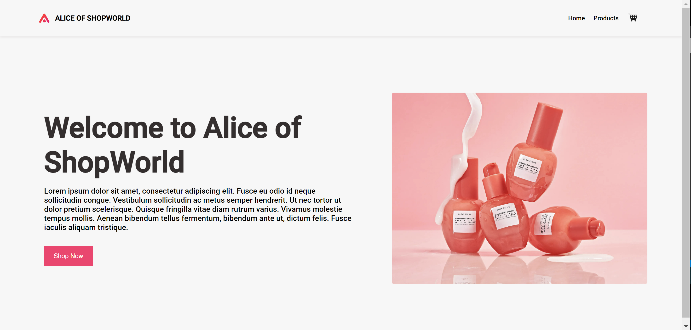

# Alice of WorldShop

## Purpose
Create a checkout experience that stores a user's cart in localStorage

## Built With

- HTML
- CSS
- JavaScript
- Node
- React
- Webpack

## Usage Instructions
- Clone the file
- Install dependencies with "npm install" in the root directory
- Install dependencies with "npm install" in the client directory
- Run the command "npm run build" to build the static files in the root directory
- Run the command "npm run serve" to start the application in the root directory
- Visit localhost:3000 in your browser

## Additional Features
- Product List/Card list page
- Cart, as outlined above
- Dummy Checkout confirmation page

## Approach
I was hoping to use the Chimoney API but, in the interest of time, went with a simple API (https://fakestoreapi.com/docs). I first built out the UI statically to get a sense of what functionality would be need on-click, on-load and so on. Then from there, I went on to dynamically generate the pages required.

## Future Improvments
- Taking advantage of React's lazy loading functionality for performance
- limit the file size of images for performance

## Created By:
Janae Welsh

---

